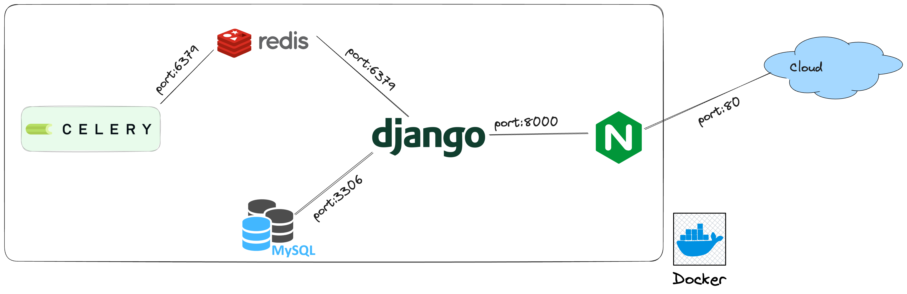

## Architecture

Reference doc - https://saasitive.com/tutorial/django-celery-redis-postgres-docker-compose/

mysql -umyuser -pmypassword 
mysql -uroot -prootpassword

## Apis
http://localhost/api/db-status/check-db/
http://localhost/api/task1/task1/